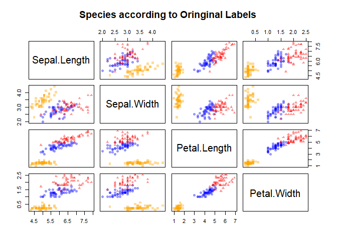
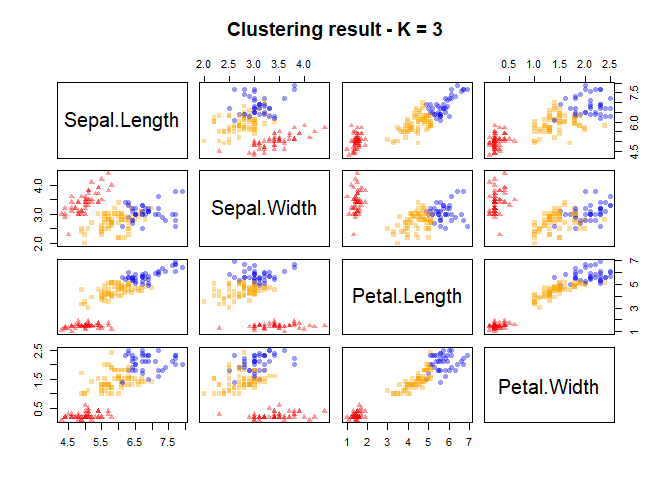

K-means
================

I am going to work with the Iris dataset to demonstate K-means

``` r
data(iris)

str(iris)
```

    ## 'data.frame':    150 obs. of  5 variables:
    ##  $ Sepal.Length: num  5.1 4.9 4.7 4.6 5 5.4 4.6 5 4.4 4.9 ...
    ##  $ Sepal.Width : num  3.5 3 3.2 3.1 3.6 3.9 3.4 3.4 2.9 3.1 ...
    ##  $ Petal.Length: num  1.4 1.4 1.3 1.5 1.4 1.7 1.4 1.5 1.4 1.5 ...
    ##  $ Petal.Width : num  0.2 0.2 0.2 0.2 0.2 0.4 0.3 0.2 0.2 0.1 ...
    ##  $ Species     : Factor w/ 3 levels "setosa","versicolor",..: 1 1 1 1 1 1 1 1 1 1 ...

``` r
head(iris)
```

    ##   Sepal.Length Sepal.Width Petal.Length Petal.Width Species
    ## 1          5.1         3.5          1.4         0.2  setosa
    ## 2          4.9         3.0          1.4         0.2  setosa
    ## 3          4.7         3.2          1.3         0.2  setosa
    ## 4          4.6         3.1          1.5         0.2  setosa
    ## 5          5.0         3.6          1.4         0.2  setosa
    ## 6          5.4         3.9          1.7         0.4  setosa

Let’s remove the fifth column as it contains the species. We want to
frame this exercise as unspuervised learning problem so removing the
labels faciliates that. Ideally we will be able to identify a number of
groups that correspond to the various species types.

``` r
iris_raw <- iris[,-5]
```

The pairs R function returns a plot matrix, consisting of scatterplots
for each variable-combination of a data frame. The basic R syntax for
the pairs command is shown above.

``` r
pairs(iris_raw, pch=19, col = adjustcolor(1, 0.4))
```

<!-- -->

From the pairing plot above we can see that there are definetely
distinct groups. But I can’t really guess how many discinct groups in
total there might be in the 5 dimensional space.

Now run k-means with k=3. The parameter, nstart ensures that a best fit
from multiple runs is picked, therefore avoinding local minima.

``` r
fitted_kmeans <- kmeans(iris_raw, centers = 3, nstart = 20)
```

``` r
fitted_kmeans
```

    ## K-means clustering with 3 clusters of sizes 62, 38, 50
    ## 
    ## Cluster means:
    ##   Sepal.Length Sepal.Width Petal.Length Petal.Width
    ## 1     5.901613    2.748387     4.393548    1.433871
    ## 2     6.850000    3.073684     5.742105    2.071053
    ## 3     5.006000    3.428000     1.462000    0.246000
    ## 
    ## Clustering vector:
    ##   [1] 3 3 3 3 3 3 3 3 3 3 3 3 3 3 3 3 3 3 3 3 3 3 3 3 3 3 3 3 3 3 3 3 3 3 3
    ##  [36] 3 3 3 3 3 3 3 3 3 3 3 3 3 3 3 1 1 2 1 1 1 1 1 1 1 1 1 1 1 1 1 1 1 1 1
    ##  [71] 1 1 1 1 1 1 1 2 1 1 1 1 1 1 1 1 1 1 1 1 1 1 1 1 1 1 1 1 1 1 2 1 2 2 2
    ## [106] 2 1 2 2 2 2 2 2 1 1 2 2 2 2 1 2 1 2 1 2 2 1 1 2 2 2 2 2 1 2 2 2 2 1 2
    ## [141] 2 2 1 2 2 2 1 2 2 1
    ## 
    ## Within cluster sum of squares by cluster:
    ## [1] 39.82097 23.87947 15.15100
    ##  (between_SS / total_SS =  88.4 %)
    ## 
    ## Available components:
    ## 
    ## [1] "cluster"      "centers"      "totss"        "withinss"    
    ## [5] "tot.withinss" "betweenss"    "size"         "iter"        
    ## [9] "ifault"

To start to understand if the clusters correlate with the removed flower
label names let take a closer look at both. First, the original labels:

``` r
iris$Species
```

    ##   [1] setosa     setosa     setosa     setosa     setosa     setosa    
    ##   [7] setosa     setosa     setosa     setosa     setosa     setosa    
    ##  [13] setosa     setosa     setosa     setosa     setosa     setosa    
    ##  [19] setosa     setosa     setosa     setosa     setosa     setosa    
    ##  [25] setosa     setosa     setosa     setosa     setosa     setosa    
    ##  [31] setosa     setosa     setosa     setosa     setosa     setosa    
    ##  [37] setosa     setosa     setosa     setosa     setosa     setosa    
    ##  [43] setosa     setosa     setosa     setosa     setosa     setosa    
    ##  [49] setosa     setosa     versicolor versicolor versicolor versicolor
    ##  [55] versicolor versicolor versicolor versicolor versicolor versicolor
    ##  [61] versicolor versicolor versicolor versicolor versicolor versicolor
    ##  [67] versicolor versicolor versicolor versicolor versicolor versicolor
    ##  [73] versicolor versicolor versicolor versicolor versicolor versicolor
    ##  [79] versicolor versicolor versicolor versicolor versicolor versicolor
    ##  [85] versicolor versicolor versicolor versicolor versicolor versicolor
    ##  [91] versicolor versicolor versicolor versicolor versicolor versicolor
    ##  [97] versicolor versicolor versicolor versicolor virginica  virginica 
    ## [103] virginica  virginica  virginica  virginica  virginica  virginica 
    ## [109] virginica  virginica  virginica  virginica  virginica  virginica 
    ## [115] virginica  virginica  virginica  virginica  virginica  virginica 
    ## [121] virginica  virginica  virginica  virginica  virginica  virginica 
    ## [127] virginica  virginica  virginica  virginica  virginica  virginica 
    ## [133] virginica  virginica  virginica  virginica  virginica  virginica 
    ## [139] virginica  virginica  virginica  virginica  virginica  virginica 
    ## [145] virginica  virginica  virginica  virginica  virginica  virginica 
    ## Levels: setosa versicolor virginica

Note that the species column is a factor with labels 1, 2 and 3

``` r
fitted_kmeans$cluster
```

    ##   [1] 3 3 3 3 3 3 3 3 3 3 3 3 3 3 3 3 3 3 3 3 3 3 3 3 3 3 3 3 3 3 3 3 3 3 3
    ##  [36] 3 3 3 3 3 3 3 3 3 3 3 3 3 3 3 1 1 2 1 1 1 1 1 1 1 1 1 1 1 1 1 1 1 1 1
    ##  [71] 1 1 1 1 1 1 1 2 1 1 1 1 1 1 1 1 1 1 1 1 1 1 1 1 1 1 1 1 1 1 2 1 2 2 2
    ## [106] 2 1 2 2 2 2 2 2 1 1 2 2 2 2 1 2 1 2 1 2 2 1 1 2 2 2 2 2 1 2 2 2 2 1 2
    ## [141] 2 2 1 2 2 2 1 2 2 1

``` r
symb <- c(15, 16, 17)

iris$Species
```

    ##   [1] setosa     setosa     setosa     setosa     setosa     setosa    
    ##   [7] setosa     setosa     setosa     setosa     setosa     setosa    
    ##  [13] setosa     setosa     setosa     setosa     setosa     setosa    
    ##  [19] setosa     setosa     setosa     setosa     setosa     setosa    
    ##  [25] setosa     setosa     setosa     setosa     setosa     setosa    
    ##  [31] setosa     setosa     setosa     setosa     setosa     setosa    
    ##  [37] setosa     setosa     setosa     setosa     setosa     setosa    
    ##  [43] setosa     setosa     setosa     setosa     setosa     setosa    
    ##  [49] setosa     setosa     versicolor versicolor versicolor versicolor
    ##  [55] versicolor versicolor versicolor versicolor versicolor versicolor
    ##  [61] versicolor versicolor versicolor versicolor versicolor versicolor
    ##  [67] versicolor versicolor versicolor versicolor versicolor versicolor
    ##  [73] versicolor versicolor versicolor versicolor versicolor versicolor
    ##  [79] versicolor versicolor versicolor versicolor versicolor versicolor
    ##  [85] versicolor versicolor versicolor versicolor versicolor versicolor
    ##  [91] versicolor versicolor versicolor versicolor versicolor versicolor
    ##  [97] versicolor versicolor versicolor versicolor virginica  virginica 
    ## [103] virginica  virginica  virginica  virginica  virginica  virginica 
    ## [109] virginica  virginica  virginica  virginica  virginica  virginica 
    ## [115] virginica  virginica  virginica  virginica  virginica  virginica 
    ## [121] virginica  virginica  virginica  virginica  virginica  virginica 
    ## [127] virginica  virginica  virginica  virginica  virginica  virginica 
    ## [133] virginica  virginica  virginica  virginica  virginica  virginica 
    ## [139] virginica  virginica  virginica  virginica  virginica  virginica 
    ## [145] virginica  virginica  virginica  virginica  virginica  virginica 
    ## Levels: setosa versicolor virginica

``` r
symb[iris$Species]
```

    ##   [1] 15 15 15 15 15 15 15 15 15 15 15 15 15 15 15 15 15 15 15 15 15 15 15
    ##  [24] 15 15 15 15 15 15 15 15 15 15 15 15 15 15 15 15 15 15 15 15 15 15 15
    ##  [47] 15 15 15 15 16 16 16 16 16 16 16 16 16 16 16 16 16 16 16 16 16 16 16
    ##  [70] 16 16 16 16 16 16 16 16 16 16 16 16 16 16 16 16 16 16 16 16 16 16 16
    ##  [93] 16 16 16 16 16 16 16 16 17 17 17 17 17 17 17 17 17 17 17 17 17 17 17
    ## [116] 17 17 17 17 17 17 17 17 17 17 17 17 17 17 17 17 17 17 17 17 17 17 17
    ## [139] 17 17 17 17 17 17 17 17 17 17 17 17

``` r
par( mfrow = c(1,2) ) # split the plot window in 2 screens
symb <- c(15, 16, 17)
col <- c("orange", "blue", "red")


pairs(iris_raw, pch = symb[iris$Species], col = adjustcolor(col[iris$Species], 0.4), main = "Species according to Oringinal Labels")
```

<!-- -->

``` r
pairs(iris_raw, pch = symb[fitted_kmeans$cluster], col = adjustcolor(col[fitted_kmeans$cluster], 0.4), main = "Clustering result - K = 3")
```

<!-- -->
