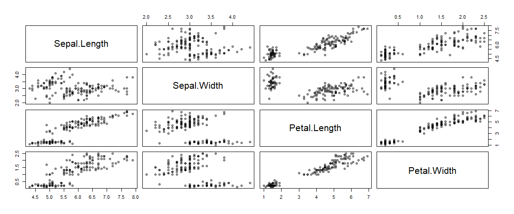

K-means
================

``` r
knitr::opts_chunk$set(fig.width=15, fig.height=8)
```

I am going to work with the Iris dataset to demonstate K-means

``` r
data(iris)

str(iris)
```

    ## 'data.frame':    150 obs. of  5 variables:
    ##  $ Sepal.Length: num  5.1 4.9 4.7 4.6 5 5.4 4.6 5 4.4 4.9 ...
    ##  $ Sepal.Width : num  3.5 3 3.2 3.1 3.6 3.9 3.4 3.4 2.9 3.1 ...
    ##  $ Petal.Length: num  1.4 1.4 1.3 1.5 1.4 1.7 1.4 1.5 1.4 1.5 ...
    ##  $ Petal.Width : num  0.2 0.2 0.2 0.2 0.2 0.4 0.3 0.2 0.2 0.1 ...
    ##  $ Species     : Factor w/ 3 levels "setosa","versicolor",..: 1 1 1 1 1 1 1 1 1 1 ...

``` r
head(iris)
```

    ##   Sepal.Length Sepal.Width Petal.Length Petal.Width Species
    ## 1          5.1         3.5          1.4         0.2  setosa
    ## 2          4.9         3.0          1.4         0.2  setosa
    ## 3          4.7         3.2          1.3         0.2  setosa
    ## 4          4.6         3.1          1.5         0.2  setosa
    ## 5          5.0         3.6          1.4         0.2  setosa
    ## 6          5.4         3.9          1.7         0.4  setosa

Let’s remove the fifth column as it contains the species. We want to
frame this exercise as unspuervised learning problem so removing the
labels faciliates that. Ideally we will be able to identify a number of
groups that correspond to the various species types.

``` r
iris_raw <- iris[,-5]
```

The pairs R function returns a plot matrix, consisting of scatterplots
for each variable-combination of a data frame. The basic R syntax for
the pairs command is shown above.

``` r
pairs(iris_raw, pch=19, col = adjustcolor(1, 0.4))
```

<!-- -->

From the pairing plot above we can see that there are definetely
distinct groups. But I can’t really guess how many discinct groups in
total there might be in the 5 dimensional space.
