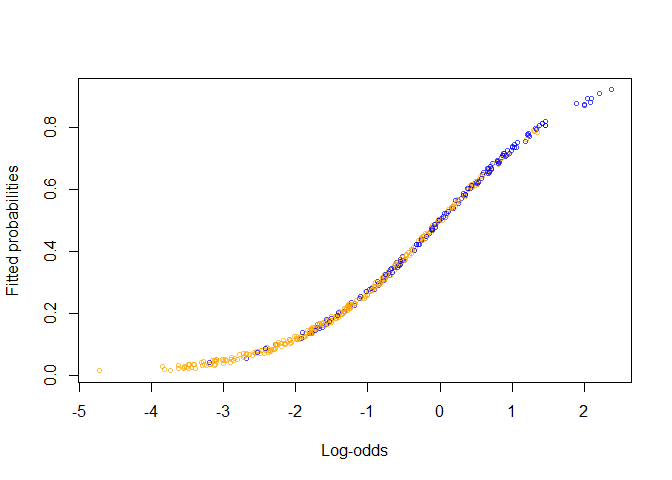
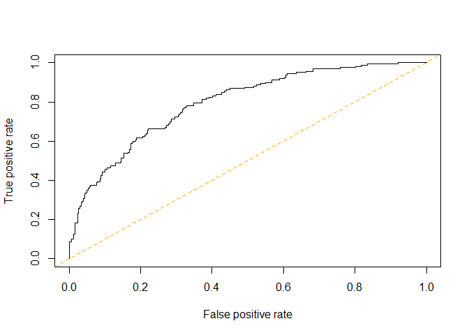

Logistic Regression
================

To illustrate logistic regression I am going to use the SAheart dataset.
It relates risk factors for coronary heart disease.

``` r
library(tidyverse)
```

    ## -- Attaching packages ------------------------------------------------------------------------------ tidyverse 1.2.1 --

    ## v ggplot2 3.2.1     v purrr   0.3.3
    ## v tibble  2.1.3     v dplyr   0.8.3
    ## v tidyr   1.0.0     v stringr 1.4.0
    ## v readr   1.3.1     v forcats 0.4.0

    ## -- Conflicts --------------------------------------------------------------------------------- tidyverse_conflicts() --
    ## x dplyr::filter() masks stats::filter()
    ## x dplyr::lag()    masks stats::lag()

``` r
library(bestglm)
```

    ## Warning: package 'bestglm' was built under R version 3.6.2

    ## Loading required package: leaps

    ## Warning: package 'leaps' was built under R version 3.6.2

``` r
library(modelr)
library(ROCR)
```

    ## Warning: package 'ROCR' was built under R version 3.6.2

    ## Loading required package: gplots

    ## Warning: package 'gplots' was built under R version 3.6.2

    ## 
    ## Attaching package: 'gplots'

    ## The following object is masked from 'package:stats':
    ## 
    ##     lowess

``` r
data(SAheart)
data = as_tibble(SAheart)
str(data)
```

    ## Classes 'tbl_df', 'tbl' and 'data.frame':    462 obs. of  10 variables:
    ##  $ sbp      : int  160 144 118 170 134 132 142 114 114 132 ...
    ##  $ tobacco  : num  12 0.01 0.08 7.5 13.6 6.2 4.05 4.08 0 0 ...
    ##  $ ldl      : num  5.73 4.41 3.48 6.41 3.5 6.47 3.38 4.59 3.83 5.8 ...
    ##  $ adiposity: num  23.1 28.6 32.3 38 27.8 ...
    ##  $ famhist  : Factor w/ 2 levels "Absent","Present": 2 1 2 2 2 2 1 2 2 2 ...
    ##  $ typea    : int  49 55 52 51 60 62 59 62 49 69 ...
    ##  $ obesity  : num  25.3 28.9 29.1 32 26 ...
    ##  $ alcohol  : num  97.2 2.06 3.81 24.26 57.34 ...
    ##  $ age      : int  52 63 46 58 49 45 38 58 29 53 ...
    ##  $ chd      : int  1 1 0 1 1 0 0 1 0 1 ...

From the above you can see that all categorical variables are already
factors. The responce varaible is chd, indicating if a subject suffered
from heart coronary heart disease or not.

``` r
head(data)
```

    ## # A tibble: 6 x 10
    ##     sbp tobacco   ldl adiposity famhist typea obesity alcohol   age   chd
    ##   <int>   <dbl> <dbl>     <dbl> <fct>   <int>   <dbl>   <dbl> <int> <int>
    ## 1   160   12     5.73      23.1 Present    49    25.3   97.2     52     1
    ## 2   144    0.01  4.41      28.6 Absent     55    28.9    2.06    63     1
    ## 3   118    0.08  3.48      32.3 Present    52    29.1    3.81    46     0
    ## 4   170    7.5   6.41      38.0 Present    51    32.0   24.3     58     1
    ## 5   134   13.6   3.5       27.8 Present    60    26.0   57.3     49     1
    ## 6   132    6.2   6.47      36.2 Present    62    30.8   14.1     45     0

``` r
fit <- glm(chd ~ ., data = data, family = "binomial")

summary(fit)
```

    ## 
    ## Call:
    ## glm(formula = chd ~ ., family = "binomial", data = data)
    ## 
    ## Deviance Residuals: 
    ##     Min       1Q   Median       3Q      Max  
    ## -1.7781  -0.8213  -0.4387   0.8889   2.5435  
    ## 
    ## Coefficients:
    ##                  Estimate Std. Error z value Pr(>|z|)    
    ## (Intercept)    -6.1507209  1.3082600  -4.701 2.58e-06 ***
    ## sbp             0.0065040  0.0057304   1.135 0.256374    
    ## tobacco         0.0793764  0.0266028   2.984 0.002847 ** 
    ## ldl             0.1739239  0.0596617   2.915 0.003555 ** 
    ## adiposity       0.0185866  0.0292894   0.635 0.525700    
    ## famhistPresent  0.9253704  0.2278940   4.061 4.90e-05 ***
    ## typea           0.0395950  0.0123202   3.214 0.001310 ** 
    ## obesity        -0.0629099  0.0442477  -1.422 0.155095    
    ## alcohol         0.0001217  0.0044832   0.027 0.978350    
    ## age             0.0452253  0.0121298   3.728 0.000193 ***
    ## ---
    ## Signif. codes:  0 '***' 0.001 '**' 0.01 '*' 0.05 '.' 0.1 ' ' 1
    ## 
    ## (Dispersion parameter for binomial family taken to be 1)
    ## 
    ##     Null deviance: 596.11  on 461  degrees of freedom
    ## Residual deviance: 472.14  on 452  degrees of freedom
    ## AIC: 492.14
    ## 
    ## Number of Fisher Scoring iterations: 5

``` r
coefficients(fit)
```

    ##    (Intercept)            sbp        tobacco            ldl      adiposity 
    ##  -6.1507208650   0.0065040171   0.0793764457   0.1739238981   0.0185865682 
    ## famhistPresent          typea        obesity        alcohol            age 
    ##   0.9253704194   0.0395950250  -0.0629098693   0.0001216624   0.0452253496

``` r
 head(predict(fit))
```

    ##          1          2          3          4          5          6 
    ##  0.9060095 -0.7036164 -0.9397194  0.9302365  0.8144683  0.4796369

The above is getting the predicted log-odds for each observation. It’s
the equivalent of model.matrix(fit) %\*% coefficients(fit).

  
  

model.matrix can be used to create dummy variables. In this case all is
has done is add an intercept:

``` r
head(model.matrix(fit))
```

    ##   (Intercept) sbp tobacco  ldl adiposity famhistPresent typea obesity
    ## 1           1 160   12.00 5.73     23.11              1    49   25.30
    ## 2           1 144    0.01 4.41     28.61              0    55   28.87
    ## 3           1 118    0.08 3.48     32.28              1    52   29.14
    ## 4           1 170    7.50 6.41     38.03              1    51   31.99
    ## 5           1 134   13.60 3.50     27.78              1    60   25.99
    ## 6           1 132    6.20 6.47     36.21              1    62   30.77
    ##   alcohol age
    ## 1   97.20  52
    ## 2    2.06  63
    ## 3    3.81  46
    ## 4   24.26  58
    ## 5   57.34  49
    ## 6   14.14  45

Instead, to get the predicted probabilities we need:

``` r
head(predict(fit, type = 'response'))
```

    ##         1         2         3         4         5         6 
    ## 0.7121829 0.3310109 0.2809570 0.7171233 0.6930608 0.6176621

from the documentation:

the type of prediction required. The default is on the scale of the
linear predictors; the alternative “response” is on the scale of the
response variable. Thus for a default binomial model the default
predictions are of log-odds (probabilities on logit scale) and type =
“response” gives the predicted probabilities. The “terms” option
returns a matrix giving the fitted values of each term in the model
formula on the linear predictor scale.

The above is equivalent to:

  
}{1 + exp(X^Tw)}")  

#### Which of the predictors are the most significant?

From the p values we can see that tobacco, ldl, famhistPresent, typea
and age are all statistically significant.

``` r
anova(fit, test="Chisq")
```

    ## Analysis of Deviance Table
    ## 
    ## Model: binomial, link: logit
    ## 
    ## Response: chd
    ## 
    ## Terms added sequentially (first to last)
    ## 
    ## 
    ##           Df Deviance Resid. Df Resid. Dev  Pr(>Chi)    
    ## NULL                        461     596.11              
    ## sbp        1   16.786       460     579.32 4.184e-05 ***
    ## tobacco    1   33.461       459     545.86 7.272e-09 ***
    ## ldl        1   20.120       458     525.74 7.273e-06 ***
    ## adiposity  1    2.617       457     523.13 0.1057574    
    ## famhist    1   22.556       456     500.57 2.042e-06 ***
    ## typea      1    6.244       455     494.33 0.0124635 *  
    ## obesity    1    7.685       454     486.64 0.0055694 ** 
    ## alcohol    1    0.113       453     486.53 0.7369612    
    ## age        1   14.388       452     472.14 0.0001487 ***
    ## ---
    ## Signif. codes:  0 '***' 0.001 '**' 0.01 '*' 0.05 '.' 0.1 ' ' 1

We must look at the difference between the null deviance, which is the
deviance of the null model (i.e., model with only the intercept), and
the residual deviance. The bigger is difference the best our model is
doing against the null model.

### Confidence Intervals

``` r
w <- coef(fit)
```

``` r
summary(fit)$coefficients
```

    ##                     Estimate  Std. Error     z value     Pr(>|z|)
    ## (Intercept)    -6.1507208650 1.308260018 -4.70145138 2.583188e-06
    ## sbp             0.0065040171 0.005730398  1.13500273 2.563742e-01
    ## tobacco         0.0793764457 0.026602843  2.98375801 2.847319e-03
    ## ldl             0.1739238981 0.059661738  2.91516648 3.554989e-03
    ## adiposity       0.0185865682 0.029289409  0.63458325 5.257003e-01
    ## famhistPresent  0.9253704194 0.227894010  4.06052980 4.896149e-05
    ## typea           0.0395950250 0.012320227  3.21382267 1.309805e-03
    ## obesity        -0.0629098693 0.044247743 -1.42176449 1.550946e-01
    ## alcohol         0.0001216624 0.004483218  0.02713729 9.783502e-01
    ## age             0.0452253496 0.012129752  3.72846442 1.926501e-04

Extract just the standard errors:

``` r
se = summary(fit)$coefficients[,2]
```

Compute the confidence intervals for each weight:

``` r
lower <- w-1.96*se
upper <- w+1.96*se
```

``` r
confidence_intervals <- cbind(lower = lower, w = w, upper = upper)
```

``` r
confidence_intervals
```

    ##                       lower             w       upper
    ## (Intercept)    -8.714910501 -6.1507208650 -3.58653123
    ## sbp            -0.004727563  0.0065040171  0.01773560
    ## tobacco         0.027234874  0.0793764457  0.13151802
    ## ldl             0.056986892  0.1739238981  0.29086090
    ## adiposity      -0.038820673  0.0185865682  0.07599381
    ## famhistPresent  0.478698160  0.9253704194  1.37204268
    ## typea           0.015447380  0.0395950250  0.06374267
    ## obesity        -0.149635445 -0.0629098693  0.02381571
    ## alcohol        -0.008665445  0.0001216624  0.00890877
    ## age             0.021451035  0.0452253496  0.06899966

``` r
log_odds <- predict(fit)


probs <- predict(fit, type = "response") # equivalent to 'phat <- fitted(fit)'

colours <- c("orange", "blue") 
plot(log_odds, jitter(probs, amount = 0.01),
col = adjustcolor(colours[SAheart$chd + 1], 0.7), cex = 0.7,
xlab = "Log-odds", ylab = "Fitted probabilities")
```

<!-- -->

#### Goodness of fit tests

The Peason test statistic:

  
^2}{\\hat{p}_{i}(1-\\hat{p}_{i})}}")  

The denominator is standardising each term by the variance of the
estimated bernouilli distribition.

``` r
residuals_pearson <- residuals(fit, type = "pearson")
tests_pearson <- sum(residuals_pearson^2)
tests_pearson
```

    ## [1] 451.9677

The deviance test statistic:

``` r
residuals_deviance <- residuals(fit, type = "deviance")
test_deviance <- sum(residuals_deviance^2)
test_deviance
```

    ## [1] 472.14

``` r
# equivalent to
#deviance(fit)
```

Both test statistics are have a
,where
 is the
number of distinct observations and
 is the
number of parameters.

``` r
nd = nrow(unique(model.matrix(fit)))
np = length(fit$coeff)

1 - pchisq(tests_pearson, nd-np)
```

    ## [1] 0.4915821

The result is well above 0.05 which is indicative of a good fit.

### Predictions

Next I move on to performing predictions using the fitted weights

Note that this analysis is carried out with the same data as the
training data.

``` r
tau <- 0.5
p <- fitted(fit) #same as predict(fit, type="response") (see above)
pred <- ifelse(p > tau, 1, 0)
```

#### ROCR Package

The ROCR package first requires the creation of a prediction object:

``` r
prediction_obj <- prediction(fitted(fit), data$chd)
```

``` r
perf <- performance(prediction_obj, "tpr", "fpr")
plot(perf)
abline(0,1, col = "orange", lty = 2)
```

<!-- -->

And compute the area under the curve (AUC)

``` r
auc <- performance(prediction_obj, "auc")
auc@y.values
```

    ## [[1]]
    ## [1] 0.7947848

Accuracy:

  
  

Precision is the fraction of results classified as positive, which are
indeed positive. (Positive predictive value):

  
  

Recall is the fraction of all positive results which were detected. Also
known as sensitivity or True positive rate

  
  

False positve rate (FPR). Of those that are truly negative, how many are
falsely classified as positive?:

  
  

Specificity. Of those that are truly negative, how many are classified
as negative?:

  
  

For spam detection, you need to maximise precision for the spam. For
medical diagnosis you want to maximise recall.

The ROC curve plots false positve rate versus true positive rate

When should one use the ROC curve vserus the precision-recall curve?

An excellent explanation can be found
[here](https://machinelearningmastery.com/roc-curves-and-precision-recall-curves-for-classification-in-python/).

ROC Curves summarize the trade-off between the true positive rate and
false positive rate for a predictive model using different probability
thresholds. Precision-Recall curves summarize the trade-off between the
true positive rate and the positive predictive value for a predictive
model using different probability thresholds. ROC curves are appropriate
when the observations are balanced between each class, whereas
precision-recall curves are appropriate for imbalanced datasets.
